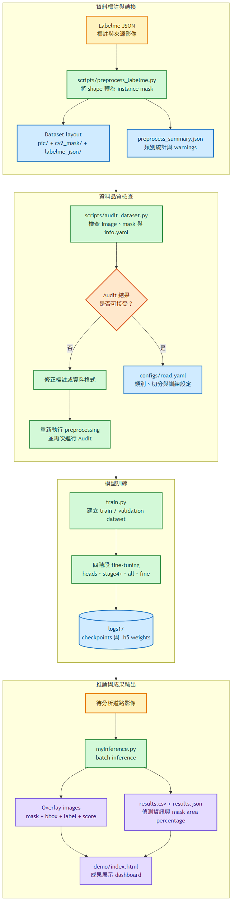
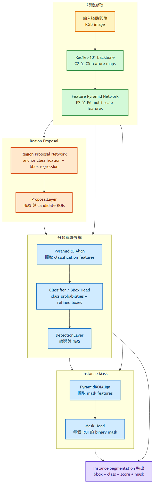
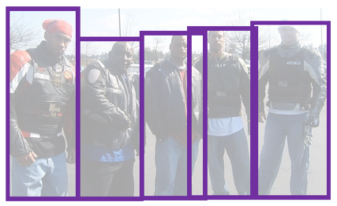
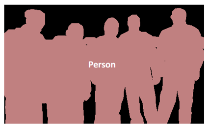
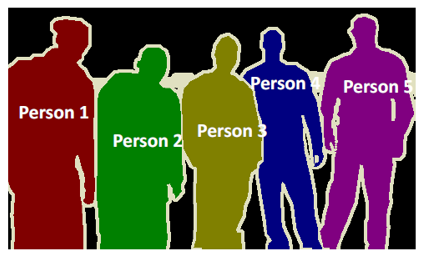
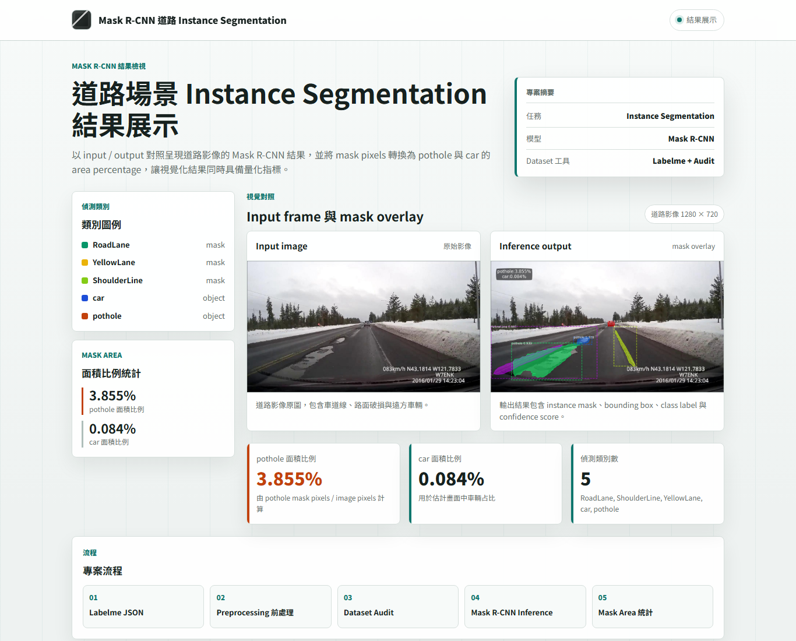

# Mask R-CNN Road Instance Segmentation

<!-- Push 上 GitHub 後，把下面這行取消註解，並將 USERNAME 換成你的 GitHub 帳號，
CI badge 就會顯示：


-->

這是一個以 TensorFlow 1.x / Keras 2.x 版本的 Mask R-CNN 為基礎，針對道路場景進行 instance segmentation 的 legacy 專案。流程從 Labelme 標註資料開始，經過資料前處理、Mask R-CNN 訓練、batch inference，最後輸出視覺化結果與各類別 mask 面積比例統計。

偵測類別：

- `RoadLane`
- `ShoulderLine`
- `YellowLane`
- `car`
- `pothole`


## 專案亮點 Project Highlights

- **Labelme preprocessing pipeline**：將 Labelme JSON 轉成 Matterport Mask R-CNN 可讀取的 dataset layout。
- **Dataset audit tool**：在 training 前檢查 image、mask、`info.yaml` 是否一致，降低資料格式錯誤造成的訓練問題。
- **Config-driven workflow**：使用 `configs/road.yaml` 集中管理 dataset、training、inference 重要設定。
- **Batch inference output**：輸出 overlay image、`results.csv`、`results.json`，方便後續分析與展示。
- **Mask area statistics**：根據 mask pixels 計算 `pothole`、`car` 等 class 的畫面占比。
- **Web demo dashboard**：以結果展示 dashboard 呈現 input/output 對照、類別圖例與量化指標。
- **Evaluation script**：提供 IoU、Dice、Precision、Recall 等 pixel-level metrics 的基礎評估工具。

## 系統架構

本節將專案拆成端到端工作流程與 Mask R-CNN 模型架構，分別說明資料如何從 Labelme 標註流向訓練與推論，以及模型如何產生 class、bounding box 與 instance mask。

### 端到端工作流程

流程從 Labelme JSON 開始，先建立 Matterport Mask R-CNN 所需的 dataset layout，再經 Dataset Audit、四階段 fine-tuning 與 batch inference，最後輸出視覺化影像及結構化統計資料。



[檢視 Mermaid 原始檔](docs/diagrams/readme_01_flowchart_project_workflow.mmd)

### Mask R-CNN 模型架構

模型以 ResNet-101 與 Feature Pyramid Network 擷取多尺度特徵，由 Region Proposal Network 產生候選區域，再透過分類／邊界框與 Mask 兩條分支輸出 instance segmentation 結果。



[檢視 Mermaid 原始檔](docs/diagrams/readme_02_flowchart_mask_rcnn_architecture.mmd)

## 快速開始 Quick Start

若只是想快速瀏覽成果，可以直接用瀏覽器開啟：

```text
demo/index.html
```

若想驗證公開 sample pipeline，可以先安裝 dev dependencies。這組 dependencies 只需要一般的 Python 3.9+ 環境，不需要安裝 TensorFlow，也不需要 legacy 環境：

```bash
pip install -r requirements-dev.txt
```

執行 Labelme preprocessing mini demo：

```bash
python scripts/preprocess_labelme.py \
  --input samples/labelme_json \
  --output samples/output \
  --overwrite
```

執行 Dataset audit：

```bash
python scripts/audit_dataset.py \
  --dataset samples/output \
  --output samples/output/audit_report.json \
  --text-output samples/output/audit_report.txt \
  --preview-dir samples/output/audit_previews
```

`samples/output/` 不會進入 Git；產生的結果可以和 repo 內 committed 的 [samples/expected/](samples/expected) 對照——除了 metadata 內記錄的輸出路徑外，內容應該完全一致。

執行 tests：

```bash
python -m pytest -q tests
```

## CV 任務概念 CV Task Primer

在進入道路場景前，先用一組簡化示意圖說明三種常見 computer vision tasks 的差異。本專案採用的是第三種：instance segmentation。

| Object Detection | Semantic Segmentation | Instance Segmentation |
|---|---|---|
|  |  |  |
| 偵測每個 object 的類別與 bounding box，重點是「在哪裡」。 | 對每個 pixel 指派 class label，同類別區域會被視為同一群。 | 同時保留 pixel-level mask 與 individual instances，能區分同類別的不同物件。 |

在道路場景中，instance segmentation 可以同時輸出 `RoadLane`、`YellowLane`、`car`、`pothole` 等物件的 mask、bounding box 與 confidence score。本專案進一步利用 mask pixels 計算 `pothole` 與 `car` 的畫面占比，作為道路狀態量化指標。

## 專案結構 Repository Structure

```text
.github/workflows/        # CI：pytest 與 mini demo smoke test
configs/                  # YAML 設定檔，集中管理 dataset / training / inference 參數
demo/                     # Web demo dashboard
docs/                     # Dataset、environment、results、evaluation 等補充文件
figure/                   # README 與 demo 使用的展示圖片
mrcnn/                    # Matterport Mask R-CNN core implementation
samples/                  # 可公開的 mini demo sample dataset 與預期輸出
scripts/                  # preprocessing、dataset audit、evaluation tools
tests/                    # preprocessing / audit / evaluation 的 pytest tests
train.py                  # Mask R-CNN training entry point
myInference.py            # batch inference 與 mask area statistics entry point
```

## 環境設定

本專案分成兩種環境：

- **Demo / tests 環境**：preprocessing、dataset audit、evaluation scripts 與 pytest 只需要 Python 3.9+ 加 `requirements-dev.txt`，不需要 TensorFlow。
- **Training / inference 環境**：`train.py` 與 `myInference.py` 對應 TensorFlow 1.15 時期的技術棧，建議使用獨立的 Conda environment，並固定在 Python 3.6 或 3.7。

```bash
conda env create -f environment.yml
conda activate mask-rcnn-road
pip install -e .
```

如果沒有 TensorFlow 1.15 GPU 環境，可以將 `requirements-legacy.txt` 中的 `tensorflow-gpu==1.15.0` 改成 `tensorflow==1.15.0`。

詳細環境說明請見 [docs/environment.md](docs/environment.md)。

## Dataset 前處理

先使用 Labelme 標註影像，再將 Labelme JSON 轉成訓練程式需要的 dataset layout：

```bash
python scripts/preprocess_labelme.py \
  --input data/labelme_json \
  --output mydataset \
  --overwrite
```

輸出結構：

```text
mydataset/
  pic/
  cv2_mask/
  labelme_json/
```

每個 `cv2_mask/*.png` 都是 single-channel instance mask。像素值 `0` 代表 background，`1..N` 代表不同 instance；對應的 `info.yaml` 會記錄每個 instance id 的 class label。

完整 dataset 格式請見 [docs/dataset.md](docs/dataset.md)。

## Mini Demo

如果沒有原始 private dataset，可以先跑內建的 mini demo 驗證 preprocessing pipeline：

```bash
python scripts/preprocess_labelme.py \
  --input samples/labelme_json \
  --output samples/output \
  --overwrite
```

這會產生 `samples/output/preprocess_summary.json`，並輸出 class counts、warnings、mask 是否有效等檢查結果。`samples/expected/` 保存同一份 demo 的預期輸出，可以直接對照驗證。

## Dataset Audit 檢查

在 training 前，可以先檢查 `mydataset/` 的 image、mask、`info.yaml` 是否一致：

```bash
python scripts/audit_dataset.py \
  --dataset mydataset \
  --output reports/dataset_audit.json \
  --text-output reports/dataset_audit.txt \
  --preview-dir reports/previews
```

Audit tool 會檢查空 mask、尺寸不一致、instance ids 對不上、未知 labels，並統計每個 class 的 instance 數量與 mask pixels。詳細說明請見 [docs/dataset_audit.md](docs/dataset_audit.md)。

## 設定檔 Configuration

常用設定集中在 `configs/road.yaml`，training / inference CLI 仍可覆寫 YAML 內的值：

```bash
python train.py --config configs/road.yaml
python myInference.py --config configs/road.yaml
```

設定說明請見 [docs/configuration.md](docs/configuration.md)。

## Model Card 模型卡

專案目的、input/output、dataset/weights 限制、known limitations 與 future work 請見 [docs/model_card.md](docs/model_card.md)。

## 訓練 Training

從最新 checkpoint 繼續訓練：

```bash
python train.py --dataset mydataset --init-with last
```

從 COCO weights 開始 transfer learning：

```bash
python train.py \
  --dataset mydataset \
  --init-with coco \
  --coco-weights mask_rcnn_coco.h5
```

預設 training schedule 保留原本的四階段訓練策略：

- heads：epoch 0 到 30
- ResNet stage 4+：epoch 30 到 60
- all layers：epoch 60 到 100
- all layers fine-tuning：epoch 100 到 150

可以用 CLI 覆寫 epoch 設定：

```bash
python train.py \
  --dataset mydataset \
  --init-with coco \
  --epochs-heads 10 \
  --epochs-stage4 20 \
  --epochs-all 40 \
  --epochs-fine 60
```

訓練產生的 logs 與 checkpoints 預設會寫入 `logs1/`。

## 推論 Inference

執行 batch inference 並輸出面積比例統計：

```bash
python myInference.py \
  --weights weights/road_mask_rcnn.h5 \
  --input-folder images \
  --output-folder output_space
```

Inference script 會輸出：

- 疊加 mask、bounding box、label、score 的 overlay images
- `results.csv`
- `results.json`

CSV/JSON 會記錄每張影像的 detection metadata 與 class-wise mask area percentage。預設追蹤：

- `pothole_area_pct`
- `car_area_pct`

也可以指定要計算面積比例的 classes：

```bash
python myInference.py \
  --weights weights/road_mask_rcnn.h5 \
  --input-folder images \
  --output-folder output_space \
  --area-classes pothole car RoadLane
```

Inference output schema 請見 [docs/results.md](docs/results.md)。

## 結果展示 Web Demo

`demo/index.html` 提供一個結果展示 dashboard，可用來呈現 input/output 對照、類別圖例、mask overlay 與 mask area statistics。說明請見 [demo/README.md](demo/README.md)。



## 評估 Evaluation

若未來有 prediction masks，可以使用 `scripts/evaluate_masks.py` 比較 ground truth / prediction masks，輸出 IoU、Dice、Precision、Recall。詳細說明請見 [docs/evaluation.md](docs/evaluation.md)。

## 測試 Testing

Tests 只依賴 `requirements-dev.txt`，在一般 Python 3.9+ 環境即可執行，不需要 TensorFlow。GitHub Actions 會在每次 push 時自動跑 pytest 與 mini demo smoke test。

```bash
pip install -r requirements-dev.txt
python -m pytest -q tests
```

如果本機 pytest plugin 載入過慢或互相干擾，可以暫時關閉 plugin autoload：

```powershell
$env:PYTEST_DISABLE_PLUGIN_AUTOLOAD='1'
python -m pytest -q tests
```

## 注意事項

Dataset、trained weights、logs、generated predictions 通常檔案較大，也可能包含私人資料，因此不放入 Git。

`mrcnn/` package 基於 Matterport Mask R-CNN 實作，保留 MIT License 與原始來源註記。

README 與 demo 使用的道路示意影像（`figure/img109.jpg`、`figure/output.jpg`）擷取自網路上公開分享的行車記錄器影片，僅作為研究與成果展示用途，不屬於本專案的訓練資料發佈。若您是原始影片作者且希望移除，請開 issue 聯絡。

## 參考資料 References

- Matterport Mask R-CNN: https://github.com/matterport/Mask_RCNN
- He, K., Gkioxari, G., Dollar, P., and Girshick, R. Mask R-CNN. ICCV 2017.
