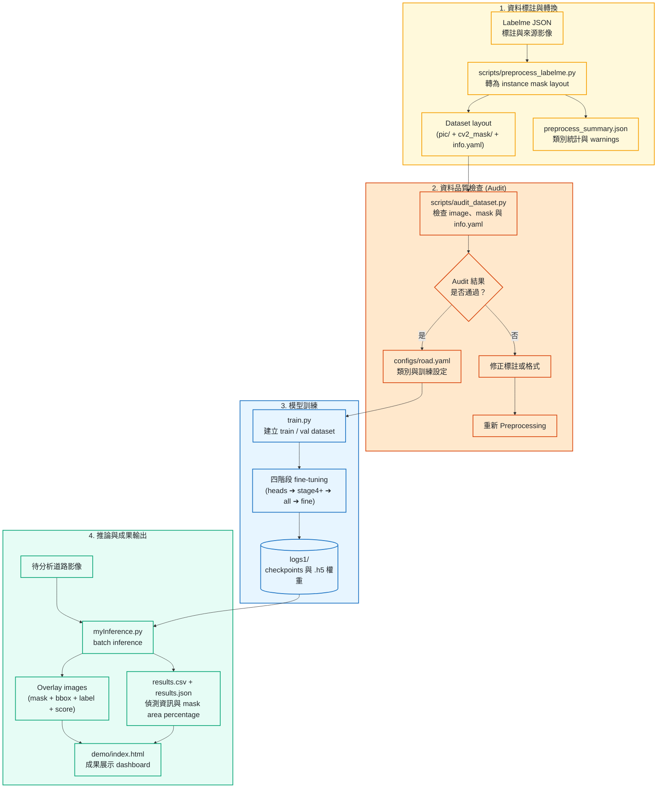
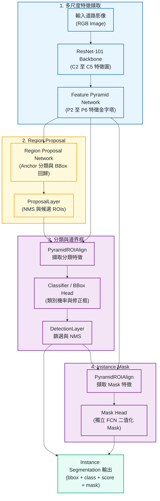
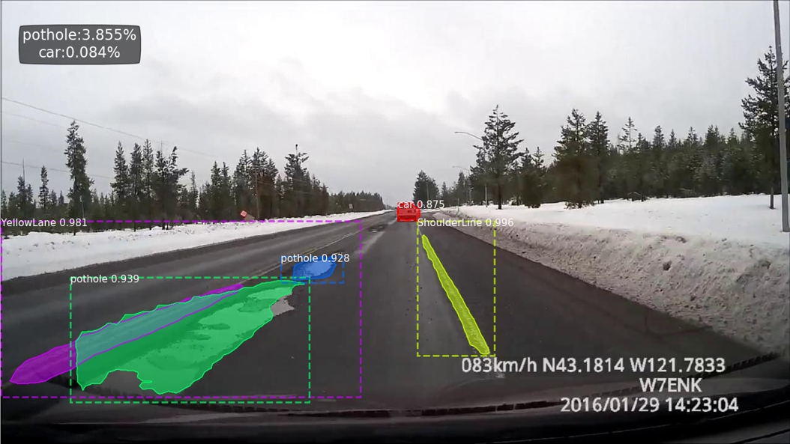
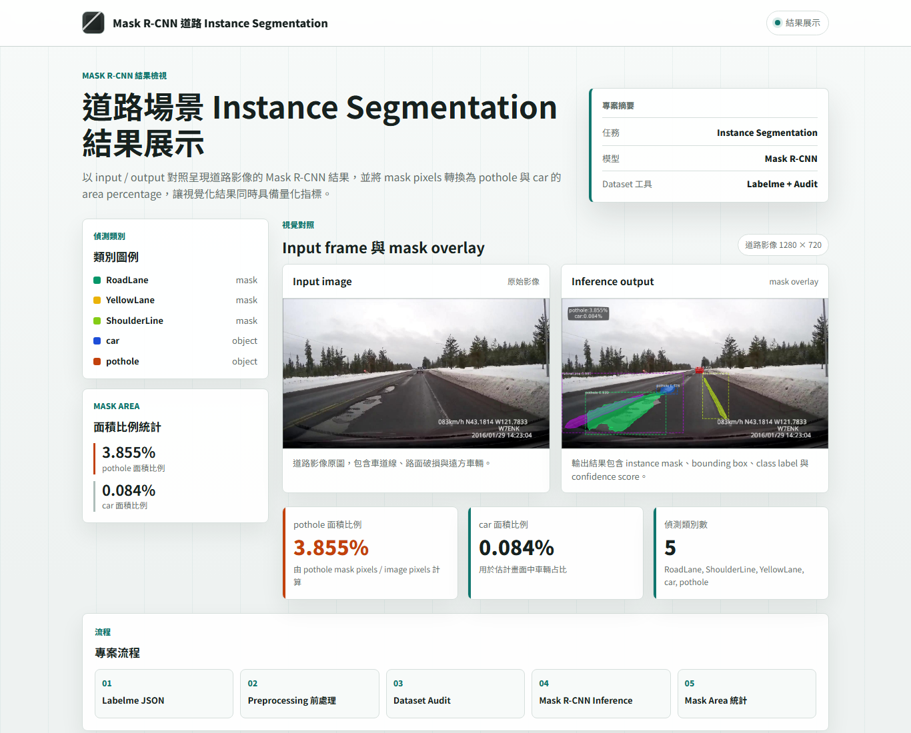
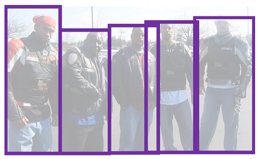
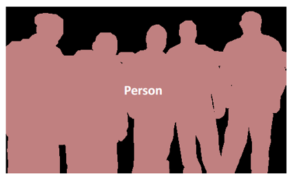
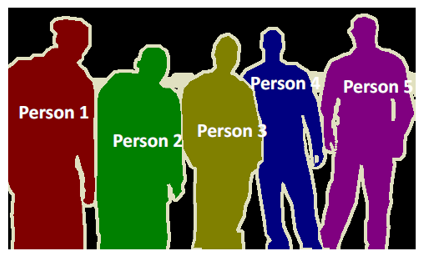

# mask-rcnn-road

[](https://github.com/kuotunyu/mask-rcnn-road/actions/workflows/tests.yml)


[](LICENSE)

本專案為基於 Mask R-CNN (ResNet-101 + FPN) 之道路場景實例分割 (Instance Segmentation) 系統：針對包含車道線 (`RoadLane`)、路肩線 (`ShoulderLine`)、黃虛線 (`YellowLane`)、車輛 (`car`) 與坑洞 (`pothole`) 進行 5 類別物件與 Mask 分割。系統提供 Labelme 標註轉換、Dataset 格式稽核、四階段 Fine-tuning 訓練、批次推論、Mask 面積比例量化統計與 Web Dashboard 展示。

---

## 技術亮點

1. **Labelme 標註轉檔與 Dataset 稽核工具**：
   提供腳本將 Labelme JSON 轉為 Matterport Mask R-CNN 標準 dataset layout，並具備自動稽核工具 (Audit Tool) 檢查空 Mask、尺寸不符與標註缺漏。
2. **組態驅動 (YAML Config) 四階段訓練**：
   使用 `configs/road.yaml` 集中管理參數，採用 heads ➔ ResNet stage 4+ ➔ all layers ➔ fine-tuning 四階段學習率調控。
3. **面積比例量化統計與 Web Dashboard**：
   批次推論自動輸出 overlay 視覺圖、`results.csv` 與 `results.json`，計算坑洞與車輛之像素畫面佔比，並提供 HTML 互動式展示面板。

---

## 系統架構與 Pipeline

### 1. 端到端工作流程


```mermaid
%%{init: {'themeVariables': {'fontSize': '20px'}}}%%
flowchart TD
    subgraph Preparation ["1. 資料標註與轉換"]
        Labelme["Labelme JSON<br/>標註與來源影像"] --> Preprocess["scripts/preprocess_labelme.py<br/>轉為 instance mask layout"]
        Preprocess --> Dataset["Dataset layout<br/>(pic/ + cv2_mask/ + info.yaml)"]
        Preprocess --> Summary["preprocess_summary.json<br/>類別統計與 warnings"]
    end

    subgraph Quality ["2. 資料品質檢查 (Audit)"]
        Dataset --> Audit["scripts/audit_dataset.py<br/>檢查 image、mask 與 info.yaml"]
        Audit --> AuditResult{"Audit 結果<br/>是否通過？"}
        AuditResult -->|否| Fix["修正標註或格式"] --> Retry["重新 Preprocessing"]
        AuditResult -->|是| ProjectConfig["configs/road.yaml<br/>類別與訓練設定"]
    end

    subgraph Training ["3. 模型訓練"]
        ProjectConfig --> Train["train.py<br/>建立 train / val dataset"]
        Train --> Schedule["四階段 fine-tuning<br/>(heads ➔ stage4+ ➔ all ➔ fine)"]
        Schedule --> Weights[("logs1/<br/>checkpoints 與 .h5 權重")]
    end

    subgraph Application ["4. 推論與成果輸出"]
        Images["待分析道路影像"] & Weights --> Inference["myInference.py<br/>batch inference"]
        Inference --> Visuals["Overlay images<br/>(mask + bbox + label + score)"]
        Inference --> Reports["results.csv + results.json<br/>偵測資訊與 mask area percentage"]
        Visuals & Reports --> Dashboard["demo/index.html<br/>成果展示 dashboard"]
    end

    classDef prepStyle fill:#fff9db,stroke:#f59f00,stroke-width:2px,color:#212529
    classDef qualStyle fill:#FFE8CC,stroke:#D9480F,stroke-width:2px,color:#212529
    classDef trainStyle fill:#e7f5ff,stroke:#1971c2,stroke-width:2px,color:#212529
    classDef appStyle fill:#e6fcf5,stroke:#0ca678,stroke-width:2px,color:#212529

    class Preparation,Labelme,Preprocess,Dataset,Summary prepStyle
    class Quality,Audit,AuditResult,Fix,Retry,ProjectConfig qualStyle
    class Training,Train,Schedule,Weights trainStyle
    class Application,Images,Inference,Visuals,Reports,Dashboard appStyle
```

### 2. Mask R-CNN 模型架構


```mermaid
%%{init: {'themeVariables': {'fontSize': '20px'}}}%%
flowchart TD
    subgraph FeatureStage ["1. 多尺度特徵擷取"]
        Input["輸入道路影像<br/>(RGB Image)"] --> Backbone["ResNet-101 Backbone<br/>(C2 至 C5 特徵圖)"]
        Backbone --> FPN["Feature Pyramid Network<br/>(P2 至 P6 特徵金字塔)"]
    end

    subgraph ProposalStage ["2. Region Proposal"]
        FPN --> RPN["Region Proposal Network<br/>(Anchor 分類與 BBox 回歸)"]
        RPN --> Proposals["ProposalLayer<br/>(NMS 與候選 ROIs)"]
    end

    subgraph DetectionStage ["3. 分類與邊界框"]
        Proposals & FPN --> ClassROI["PyramidROIAlign<br/>擷取分類特徵"]
        ClassROI --> ClassHead["Classifier / BBox Head<br/>(類別機率與修正框)"]
        ClassHead --> Detections["DetectionLayer<br/>篩選與 NMS"]
    end

    subgraph MaskStage ["4. Instance Mask"]
        Detections & FPN --> MaskROI["PyramidROIAlign<br/>擷取 Mask 特徵"]
        MaskROI --> MaskHead["Mask Head<br/>(獨立 FCN 二值化 Mask)"]
    end

    Detections & MaskHead --> Output["Instance Segmentation 輸出<br/>(bbox + class + score + mask)"]

    classDef featStyle fill:#e7f5ff,stroke:#1971c2,stroke-width:2px,color:#212529
    classDef propStyle fill:#fff9db,stroke:#f59f00,stroke-width:2px,color:#212529
    classDef headStyle fill:#f3e5f5,stroke:#7b1fa2,stroke-width:2px,color:#212529
    classDef outStyle fill:#e6fcf5,stroke:#0ca678,stroke-width:2px,color:#212529

    class FeatureStage,Input,Backbone,FPN featStyle
    class ProposalStage,RPN,Proposals propStyle
    class DetectionStage,ClassROI,ClassHead,Detections,MaskStage,MaskROI,MaskHead headStyle
    class Output outStyle
```

---

## 成果展示與 Demo

### 1. 道路實例分割結果



### 2. 成果展示 Web Dashboard (`demo/index.html`)



---

## CV 任務概念分析

| Object Detection (物件偵測) | Semantic Segmentation (語意分割) | Instance Segmentation (實例分割 - 本專案) |
|:---:|:---:|:---:|
|  |  |  |
| 僅標出物件的類別與 Bounding Box 邊界。 | 對每個 Pixel 標註類別，無法區分同類別的不同實體。 | **同時保留 Pixel 邊界與獨立實體個體，精確區分同類別不同物件**。 |

---

## 物件偵測類別

| 類別標籤 (Class Label) | 物件說明 |
|---|---|
| `RoadLane` | 車道線 |
| `ShoulderLine` | 路肩線 |
| `YellowLane` | 黃虛線 / 雙黃線 |
| `car` | 車輛實體 |
| `pothole` | 路面坑洞 |

---

## 快速開始

### 1. 安裝環境套件

```bash
# 開發與測試環境 (無 TensorFlow 需求)
pip install -r requirements-dev.txt

# 執行 Labelme 前處理 Demo
python scripts/preprocess_labelme.py --input samples/labelme_json --output samples/output --overwrite

# 執行 Dataset 稽核
python scripts/audit_dataset.py --dataset samples/output --output samples/output/audit_report.json

# 執行單元測試 (pytest)
python -m pytest -q tests
```

### 2. 批次推論與面積統計

```bash
python myInference.py --weights weights/road_mask_rcnn.h5 --input-folder images --output-folder output_space
```

導出之 `results.csv` 與 `results.json` 將包含每張影像之坑洞 (`pothole_area_pct`) 與車輛 (`car_area_pct`) 像素畫面佔比。

---

## 專案結構

| 檔案 / 目錄 | 功能說明與職責 |
|---|---|
| `configs/road.yaml` | 全域組態設定 (類別、切分與訓練參數) |
| `train.py` | Mask R-CNN 訓練入口 (四階段 Fine-tuning) |
| `myInference.py` | 批次推論與 Mask 面積比例量化統計 |
| `mrcnn/` | Matterport Mask R-CNN 核心套件實作 |
| `scripts/preprocess_labelme.py` | Labelme JSON 轉檔腳本 |
| `scripts/audit_dataset.py` | Dataset 格式與一致性自動化稽核工具 |
| `scripts/evaluate_masks.py` | Pixel-level 評估工具 (IoU, Dice, Precision, Recall) |
| `demo/index.html` | 成果展示 Web Dashboard |

---

## 授權與聲明

本專案之程式碼採 [MIT License](LICENSE)。`mrcnn/` 套件基於 Matterport Mask R-CNN 實作並保留原始聲明。
