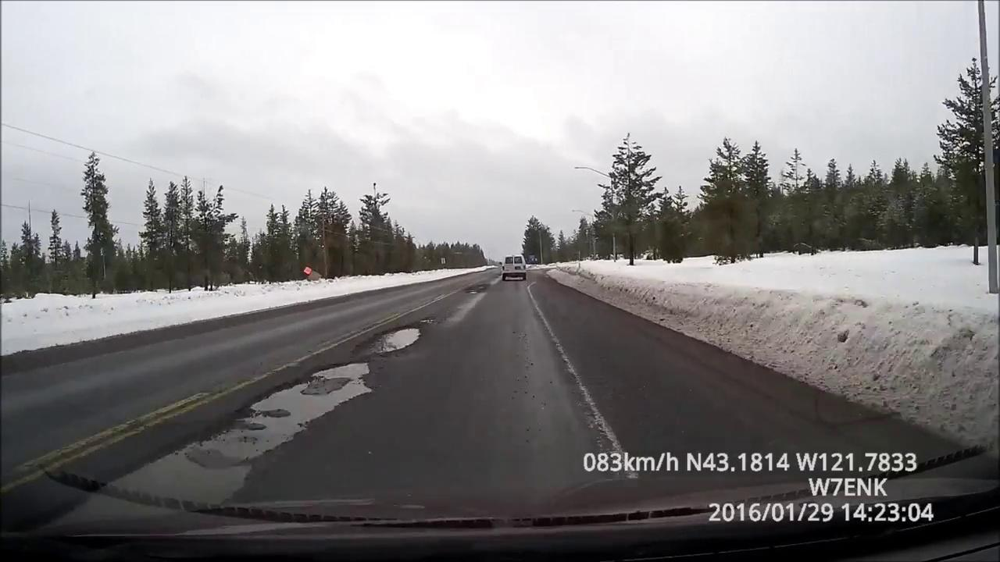
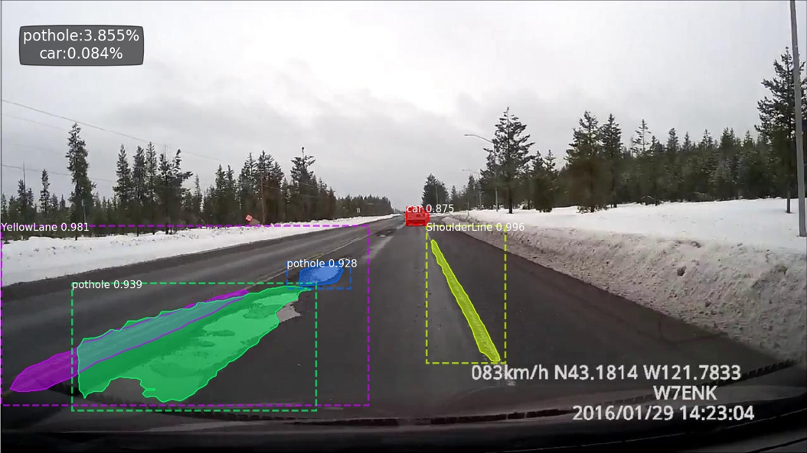
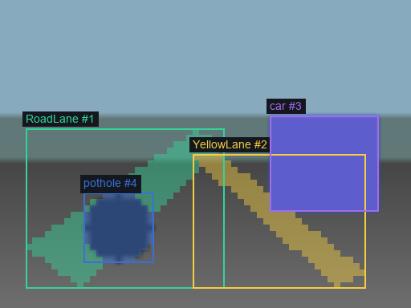

# Inference Results

`myInference.py` 會為每張 input image 產生 overlay image，並輸出 `results.csv` 與 `results.json`。這份文件說明 inference output 的內容，以及 mask area percentage 的意義。

## Result Gallery

| Input Image | Inference Output |
|---|---|
|  |  |

> 示意影像擷取自網路上公開分享的行車記錄器影片，僅作為研究與成果展示用途。

Output image 會疊加：

- segmentation mask
- bounding box
- class label
- confidence score
- `pothole` / `car` area percentage

## Command

```bash
python myInference.py \
  --weights weights/road_mask_rcnn.h5 \
  --input-folder images \
  --output-folder output_space
```

## Mask Area Percentage

Inference script 會讀取 Mask R-CNN output 中的 `r["masks"]`。每個 instance mask 都是一張 boolean mask，代表該 instance 在 image 中的 pixel 範圍。

計算方式：

```text
class_area_pct = class_mask_pixels / image_pixels * 100
```

例如：

- `pothole_area_pct`：畫面中 pothole mask pixel 所占比例
- `car_area_pct`：畫面中 car mask pixel 所占比例

這讓 segmentation result 不只是視覺化圖片，也能轉成道路狀態的量化指標。

## CSV 欄位

`results.csv` 預設包含：

- `image`：input image file name
- `output_path`：overlay image path
- `instance_count`：該圖偵測到的 instances 數量
- `pothole_area_pct`：`pothole` mask pixels / image pixels
- `car_area_pct`：`car` mask pixels / image pixels
- `detections`：每個 instance 的 JSON metadata

若使用：

```bash
python myInference.py \
  --weights weights/road_mask_rcnn.h5 \
  --input-folder images \
  --output-folder output_space \
  --area-classes pothole car RoadLane
```

CSV 會額外加入 `RoadLane_area_pct`。

## JSON 欄位

`results.json` 每筆資料包含：

```json
{
  "image": "sample.jpg",
  "output_path": "output_space/sample_output.png",
  "instance_count": 2,
  "area_percentages": {
    "pothole": 1.234,
    "car": 4.567
  },
  "detections": [
    {
      "class": "pothole",
      "score": 0.987,
      "bbox_y1x1y2x2": [120, 80, 180, 150],
      "mask_pixels": 3456,
      "area_pct": 1.234
    }
  ]
}
```

## Dataset Preview

Dataset audit tool 可以產生 image + mask overlay preview，用來確認 preprocessing 後的 mask 與 metadata 是否正確對應。



這張 sample preview 來自 `samples/` mini demo，只用來展示資料檢查流程，不代表真實訓練資料分布。
